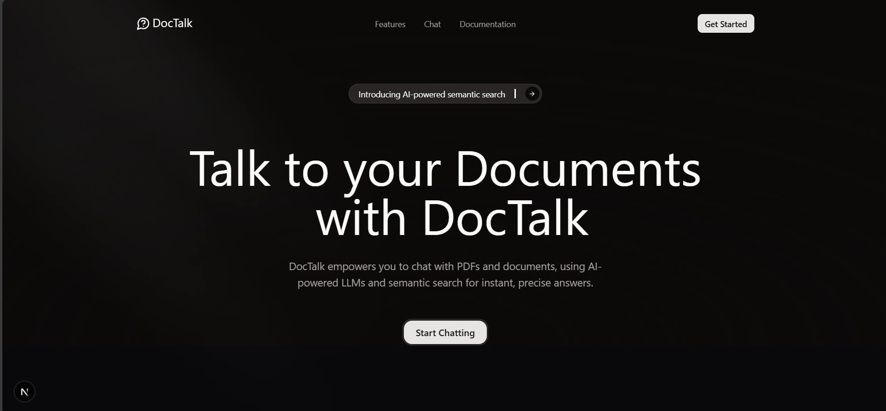

# 📄 DocTalk

**DocTalk** is an AI-powered web app that lets you chat with your PDF documents using LLMs and semantic search for quick and accurate answers.

---

## 🛠 Tech Stack

### 🧑‍🎨 Frontend  
Next.js, Tailwind CSS, Shadcn UI, Framer Motion, Typescript

### 🔧 Backend  
LangChain, Google Gemini, Quadrant DB, BullMQ, Redis, Docker, Express, Javascript

---

## 🚀 Features

- 🔍 **Chat with your PDFs**: Upload PDFs and get intelligent, context-aware answers.
- ⚙️ **Async Processing**: Background queue system for smooth performance.
- 🧠 **Semantic Search**: Retrieves precise results using embeddings.
- 🌙 **Modern UI**: Responsive design with animation and dark mode.

---
