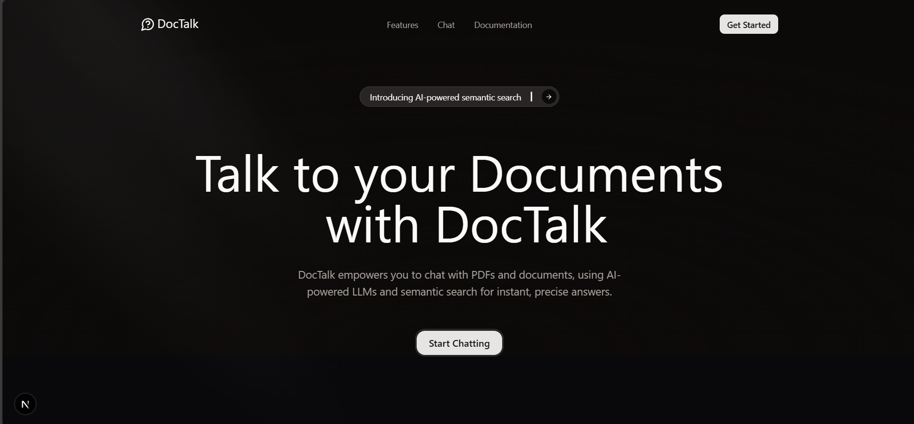
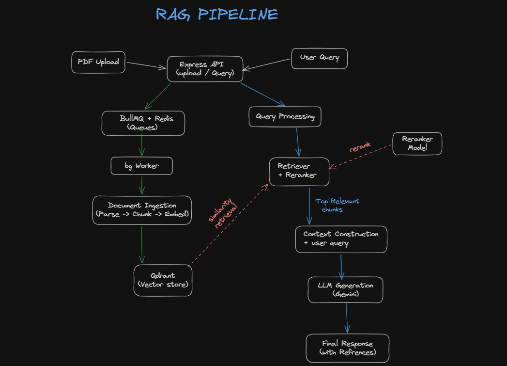

# DocTalk

**Live Demo:** https://doc-talk-nine.vercel.app/

DocTalk is an AI-powered application that lets users chat with their PDF documents using RAG, with source references for each response.

The backend processes uploaded PDFs asynchronously through a BullMQ/Redis queue, where documents are parsed, chunked, embedded, and indexed in Qdrant. For each user query, the system generates an embedding, retrieves relevant document chunks, reranks the retrieved results, and constructs a context-aware prompt for Google Gemini. The application is containerized with Docker and deployed on AWS EC2 behind Nginx, with GitHub Actions handling automated deployments.

<p align="center">
  
</p>

---

## Architecture

<p align="center">
  
</p>


---

## Tech Stack

**Frontend:** Next JS, Tailwind, ShadCN

**Backend & AI:** Node.js · Express · LangChain · Google Gemini · Qdrant vector DB · BullMQ · Redis · Reranker

**Deployment & Infrastructure:** Docker · AWS EC2 · Nginx · Vercel · GitHub Actions

---

## Setup

### 1. Clone the repository

```bash
git clone https://github.com/SarthakShrivastava-04/DocTalk.git
cd DocTalk
```

### 2. Configure the backend

```bash
cd server
pnpm install
```

Create the environment file:

```bash
touch .env
```

Configure the required environment variables:

```env
GOOGLE_API_KEY=
QDRANT_URL=
QDRANT_API_KEY=
REDIS_URL=
```

### 3. Start the backend

```bash
pnpm start
```

The backend runs on:

```text
http://localhost:8000
```

### 4. Start the frontend

Open another terminal:

```bash
cd client
pnpm install
pnpm dev
```

The frontend runs on:

```text
http://localhost:3000
```

---

## Docker Setup

The backend and supporting services can be started using Docker Compose:

```bash
cd server
docker compose up -d --build
```

Check running containers:

```bash
docker compose ps
```

View application and worker logs:

```bash
docker compose logs -f
```

Stop the services:

```bash
docker compose down
```

---
